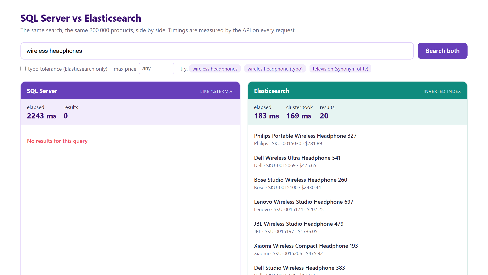
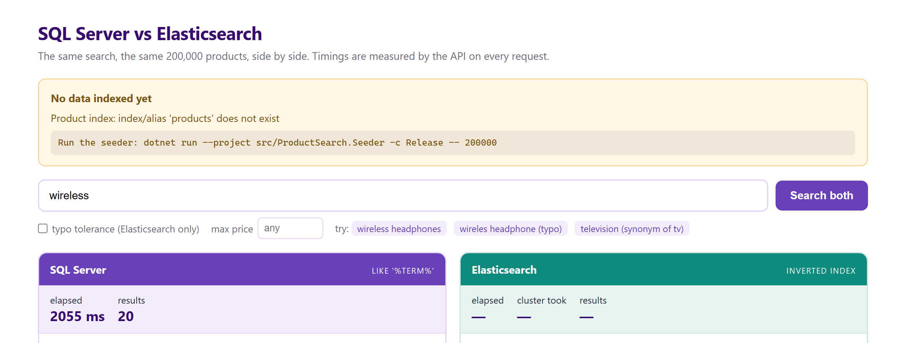

# High-Performance Search APIs in .NET 10 with Elasticsearch

A runnable proof of concept that puts **SQL Server `LIKE '%term%'` and Elasticsearch side by side** over the
same 200,000-product catalog — same data, same machine, same queries — and measures the difference.

> **Headline:** at 20 concurrent users, SQL Server p50 is **75,747 ms**. Elasticsearch is **91 ms**.
> Full method and numbers: [docs/benchmark-results.md](docs/benchmark-results.md)

Every response carries its own timing, so the difference is visible in the payload itself — no profiler needed.
The same query, hitting each engine:

```jsonc
// GET /api/search?q=wireless headphones&size=2
{
  "engine": "elasticsearch",
  "query": "wireless headphones",
  "count": 2,
  "page": 1, "size": 2, "hasMore": true,
  "elapsedMs": 32,          // measured by the API (includes network + deserialization)
  "tookMs": 19,             // reported by the cluster itself
  "items": [
    { "id": 15030, "sku": "SKU-0015030", "name": "Philips Portable Wireless Headphone 327",
      "brand": "Philips", "price": 781.89 },
    { "id": 15069, "sku": "SKU-0015069", "name": "Dell Wireless Ultra Headphone 541",
      "brand": "Dell",    "price": 475.65 }
  ],
  "facets": { "Dell": 6965, "Logitech": 6955, "Xiaomi": 6927 }   // same request, no extra queries
}
```

```jsonc
// GET /api/search/sql?q=wireless headphones&size=2
{
  "engine": "sql",
  "query": "wireless headphones",
  "count": 0,               // no match: names contain "Headphone", LIKE cannot stem
  "elapsedMs": 1328,        // and it still scanned all 200,000 rows to find nothing
  "items": [],
  "facets": null            // facet counts would need a separate GROUP BY scan per filter
}
```



---

## What is Elasticsearch?

A distributed search and analytics engine built on Apache Lucene, maintained by Elastic N.V. (first released
2010). Instead of scanning rows for matching text, it stores an **inverted index** — a map of each term to the
documents containing it — so lookup cost tracks how many documents *match*, not how many *exist*.

**Why it matters here:** a `LIKE '%term%'` has a leading wildcard, so no B-tree index can be used and every row
gets read. That cost grows with your table. An inverted index does not work that way.

### Features this POC actually demonstrates

| Feature | Where |
| --- | --- |
| Inverted index + full-text search | `/api/search` |
| Analyzers: stemming, ASCII folding, synonyms | `ProductIndex.cs` |
| Multi-fields (one value, several jobs) | `name`, `name.keyword`, `name.suggest` |
| Relevance scoring (BM25) + field boosts | `name^3, brand^2, description` |
| Filter context vs query context | `filter` clauses for brand / price / stock |
| Aggregations for facet counts | `by_brand`, `by_category` — same request |
| Typo tolerance (fuzziness) | `?fuzzy=true` |
| Autocomplete (`search_as_you_type`) | `/api/suggest` |
| Bulk indexing with per-item error checks | `ProductSearch.Seeder` |
| Index alias for zero-downtime reindexing | `products` → `products-v1` |

### What .NET 10 brings to this

The API is not just *hosted* on .NET 10 — it uses features that only exist there:

| Feature | Where you see it |
| --- | --- |
| **Minimal API validation** | `ProductSearchRequest` carries `[Required]`, `[Range]`, `[StringLength]`. An invalid request never reaches the handler — `?size=999` comes back as a 400 naming the field. |
| **OpenAPI 3.1** (3.0 previously) | `GET /openapi/v1.json` reports `"openapi": "3.1.1"` |
| **XML comments in OpenAPI** | Endpoint summaries in the document come from `///` comments in the source |
| **`Microsoft.Extensions.Validation`** | Validation moved out of ASP.NET-only territory; it ships in the shared framework, so no package reference is needed |

```jsonc
// GET /api/search?q=wireless&size=999
{
  "title": "One or more validation errors occurred.",
  "status": 400,
  "errors": { "Size": ["size must be between 1 and 100"] }
}
```

### Not covered here

Outbox/CDC syncing, `search_after` deep pagination, caching, resilience policies, multi-tenancy,
OpenTelemetry, vector/hybrid search. They are real production concerns, but each one would pull attention away
from the single question this POC exists to answer: how far does `LIKE` get you, and where does it stop?

---

## Prerequisites

- **.NET 10 SDK**
- **Docker Desktop**, at least **5 GB** allocated (Settings → Resources)
- ~3 GB disk for images, ~500 MB for data

## Quick start

```bash
git clone https://github.com/msshaikh-simform/dotnet10-elasticsearch-search-api.git
cd dotnet10-elasticsearch-search-api

docker compose up -d                                                # 1. Elasticsearch 9.5.3 + SQL Server 2022
dotnet run --project src/ProductSearch.Seeder -c Release -- 200000   # 2. seed + index (35-80s)
dotnet run --project src/ProductSearch.Api    -c Release             # 3. API + demo UI
```

Open **<http://localhost:5080>**.

> ⚠️ **Step 2 is required and is not automatic.** The API does not seed on startup. Skip it and both engines
> return zero results for everything. Run it once after the containers are healthy; re-run it any time to
> rebuild from scratch (it drops and recreates the SQL table and overwrites the Elasticsearch documents).

### Verify before you start

Elasticsearch takes ~60s to come up. Most "cannot connect" problems are just that:

```bash
curl -u elastic:changeme http://localhost:9200/_cluster/health
```

### Expected output at each step

| Step | You should see |
| --- | --- |
| `docker compose up -d` | 2 containers: `ps-elasticsearch`, `ps-sqlserver` |
| Seeder | `SQL Server loaded in 4,000-9,000 ms`, `Elasticsearch indexed in 26,000-42,000 ms (0 failures)` |
| Index check | `products-v1` — 200,000 docs, ~100 MB |
| API | Listening on `http://localhost:5080` |

---

## Try these four things

| # | Do this | What happens |
| --- | --- | --- |
| 1 | Search **`wireless headphones`** | SQL: **0 results**, 1,300–4,900 ms. Elasticsearch: **20 results**, 20–200 ms. Names contain "Headphone" singular — the stemmer matches, `LIKE` cannot. |
| 2 | Tick **typo tolerance**, search **`wireles headphone`** | Elasticsearch still finds them. SQL returns nothing. |
| 3 | Click a **brand facet** | Counts came back in the *same* request. SQL needs a separate `GROUP BY` scan per filter. |
| 4 | Type in the box | Autocomplete fires per keystroke and returns in single-digit ms. |

The panels show **elapsed** (measured by the API, includes network + deserialization) and **cluster took**
(what Elasticsearch reported). The gap between them is your own stack.

> **The demo page is unfair to Elasticsearch, deliberately.** It fires both queries at the same moment, so the
> SQL Server scan saturates every core while Elasticsearch is trying to answer. That inflates the Elasticsearch
> figure — on this machine, 20–40 ms alone becomes 150–380 ms under that contention. The benchmark below runs
> each engine separately, which is why its numbers are lower and more representative.

---

## Results

### Full-text search, 200,000 products

| Concurrency | Engine | p50 | p95 | p99 | Throughput |
| --- | --- | --- | --- | --- | --- |
| 1 | SQL Server | 2,527 ms | 2,798 ms | 2,946 ms | 0.4 req/s |
| 1 | Elasticsearch | **17 ms** | 24 ms | 31 ms | **54.2 req/s** |
| 5 | SQL Server | 16,526 ms | 25,148 ms | 25,679 ms | 0.3 req/s |
| 5 | Elasticsearch | **30 ms** | 52 ms | 72 ms | **143.4 req/s** |
| 20 | SQL Server | 75,747 ms | 91,613 ms | 92,212 ms | 0.3 req/s |
| 20 | Elasticsearch | **91 ms** | 292 ms | 304 ms | **128.2 req/s** |

**Throughput matters more than latency here.** SQL Server is stuck at 0.3–0.4 req/s at *every* concurrency
level — extra users just queue. Elasticsearch scales from 54 to 143 req/s.

One `LIKE` query over this catalog burns **12–13 seconds of CPU** to return 20 rows, because the work is
proportional to rows stored. At 20 users its p99 is 92 seconds: a timeout in any real application.

### Where SQL Server wins

| Engine | p50 | Throughput |
| --- | --- | --- |
| **SQL Server** (exact SKU) | **2 ms** | **189.4 req/s** |
| Elasticsearch | 11 ms | 86.4 req/s |

Indexed identifier, exact value — the database is the right tool. Elasticsearch is not a database replacement;
it is a read model for queries a database is bad at.

### Run it yourself

```bash
dotnet run --project src/ProductSearch.Benchmark -c Release -- --requests 40
```

Measured on an i5-1135G7 (4c/8t), 16 GB RAM, everything on one laptop. Absolute numbers are indicative — but
both engines faced identical data and conditions.

**The SQL side is deliberately steelmanned:** raw ADO.NET (no ORM), and the query splits terms and requires all
of them rather than matching one contiguous phrase. It is as fast as that approach can be made.

---

## Endpoints

| Endpoint | Purpose |
| --- | --- |
| `GET /api/search?q=&brand=&maxPrice=&fuzzy=&page=&size=` | **Primary.** Elasticsearch with filters, facets and paging |
| `GET /api/search/sql?q=&page=&size=` | SQL Server `LIKE` baseline, for comparison only |
| `GET /api/suggest?q=` | Autocomplete (`search_as_you_type`) |
| `GET /api/products/{id}` | Product detail |
| `GET /api/lookup/sql?sku=` | Exact indexed lookup -- the case SQL Server wins |
| `GET /api/health` | Per-dependency status, and whether data is seeded |
| `GET /openapi/v1.json` | OpenAPI 3.1 document |

Deep links work: `http://localhost:5080/?q=wireless+headphones&fuzzy=1`

## Project layout

```
docker-compose.yml                        Elasticsearch 9.5.3 + SQL Server 2022
src/ProductSearch.Api/
  ProductIndex.cs                         mapping, analyzers, alias  <- start here
  SearchServices.cs                       both engines, side by side
  Program.cs                              client registration, endpoints
  wwwroot/index.html                      demo UI
src/ProductSearch.Seeder/                 200k products -> SQL -> bulk index
src/ProductSearch.Benchmark/              p50/p95/p99 + throughput
docs/benchmark-results.md                 full results and method
```

**Read `ProductIndex.cs` first.** Index design decides more about search quality and speed than any query.

---

## Configuration

**Nothing needs configuring to run it.** Every setting has a local-development default, defined in one place:
[`src/ProductSearch.Api/Env.cs`](src/ProductSearch.Api/Env.cs). No credentials live anywhere else in the source.

Override any of them with environment variables:

| Variable | Default |
| --- | --- |
| `ELASTICSEARCH_URL` | `http://localhost:9200` |
| `ELASTICSEARCH_USERNAME` | `elastic` |
| `ELASTIC_PASSWORD` | `changeme` |
| `SQLSERVER_HOST` | `localhost,1433` |
| `SQLSERVER_USER` | `sa` |
| `MSSQL_SA_PASSWORD` | `Str0ng!Passw0rd` |
| `SQLSERVER_CONNECTION` | built from the above — set it to replace the whole string |

The same two password variables are read by `docker-compose.yml`, so copying `.env.example` to `.env` and
editing it changes both the containers and the apps at once (`.env` is gitignored).

> These are throwaway credentials for containers that only listen on localhost. They are defaults for
> convenience, not secrets. For anything real, use a proper secret store and enable TLS.

Seed a smaller catalog if your machine is tight:

```bash
dotnet run --project src/ProductSearch.Seeder -c Release -- 50000
```

### Reset or clean up

```bash
docker compose down          # stop containers, keep data
docker compose down -v       # stop and delete all data (start completely fresh)
```

## When something goes wrong

The most confusing failure in a project like this is the silent one: everything is running, nothing is seeded,
and every search returns zero with no explanation. So the POC checks its own dependencies and tells you.

**At startup**, before the first request:

```
  Startup check
  ─────────────────────────────────────────────────────────────
   [ OK ]  Elasticsearch    reachable at http://localhost:9200
   [FAIL]  Product index    index/alias 'products' does not exist
           -> Run the seeder: dotnet run --project src/ProductSearch.Seeder -c Release -- 200000
   [ OK ]  SQL Server       reachable, Products table present
  ─────────────────────────────────────────────────────────────
  The API will start, but searches return nothing until you seed.
```

**In the seeder**, both engines are checked *before* 200,000 products are generated, so a stopped container is
reported in a second rather than after a minute of wasted work. It exits with a non-zero code, which matters if
you ever wire this into a script:

```
  Cannot seed - the required services are not available:

  - Cannot reach SQL Server: A network-related or instance-specific error occurred...
    Start it with: docker compose up -d
    SQL Server takes longer to start than Elasticsearch, so give it a moment.
```

On success it tells you what to run next. Exit codes: `0` success, `1` dependencies unavailable,
`2` seeded but some documents failed to index.

**In the API**, every failure is a `ProblemDetails` response with a fix, not a stack trace:

```jsonc
{
  "title": "Search index missing",
  "status": 503,
  "detail": "The 'products' index does not exist. Run the seeder first. Run: dotnet run --project ..."
}
```

**In the browser**, the page checks `/api/health` on load and shows what to run:



It also distinguishes *"no results for this query"* from *"nothing has been indexed yet"* — identical-looking
states that mean completely different things.

| Situation | Status | What you are told |
| --- | --- | --- |
| No `q` supplied | 400 | Which field is missing, and an example |
| `size=999` | 400 | `size must be between 1 and 100` |
| Page beyond 10,000 results | 400 | The `max_result_window` limit, and that deep paging needs `search_after` |
| Index missing / not seeded | 503 | The exact seeder command |
| Elasticsearch not started | 503 | That it needs ~60s, and `docker compose up -d` |
| SQL Server not ready | 503 | That it starts more slowly than Elasticsearch |
| SQL timeout under load | 504 | That this is the expected finding, not a defect |
| Unknown product id | 404 | The valid id range |

## Troubleshooting

| Problem | Fix |
| --- | --- |
| `Cannot connect to localhost:9200` | Elasticsearch needs ~60s. Poll `/_cluster/health`. |
| Elasticsearch container exits | Raise Docker memory to 5 GB+. |
| `Login failed for user 'sa'` | SQL Server starts slower than Elasticsearch. Wait, retry. |
| SQL search times out | Expected above ~10 concurrent users. That is the finding, not a bug. |
| Port 5080 in use | `dotnet run --project src/ProductSearch.Api -- --urls http://localhost:5090` |

## Development-only warnings

This setup is **not production-shaped**, deliberately:

- Single Elasticsearch node, **0 replicas** → no fault tolerance
- **TLS disabled** on the HTTP layer
- Passwords in `.env`
- `DisableDirectStreaming` and 1 shard are local-development choices

Production needs multiple nodes, a considered replica count, TLS, and secrets in a real secret store.

---

## Conclusion

- **Use a database** for exact lookups, ranges, joins and transactions. It wins those, by a lot.
- **Use Elasticsearch** for text people actually type — plurals, typos, multi-word queries, facets, ranking.
- The gap is **not just speed**. `LIKE` returned *zero results* for `wireless headphones`, after 4.9 seconds.
- **Throughput is the real ceiling.** Scans cost the same whether 1 or 20 users are waiting; they simply queue.
- **Index design beats query tuning.** Field types, analyzers and multi-fields are chosen once and constrain
  everything after.
- Keep both. The database stays the source of truth; Elasticsearch is a specialised read model beside it.

## Versions

.NET 10 · Elasticsearch 9.5.3 · `Elastic.Clients.Elasticsearch` 9.5.2 · SQL Server 2022 · Bogus 35.6.5
